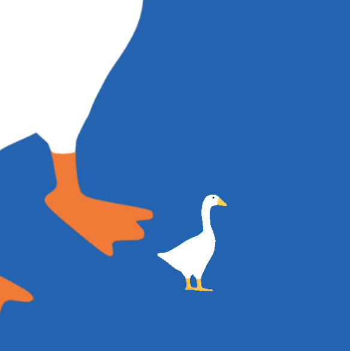

# Desktop Goose for macOS



It's a goose for your mac

## Features

Everything on screen is interactive. Click it, drag it, throw it. The goose will respond.

## Requirements

- macOS 13.0 (Ventura) or later
- Xcode 15.0 or later (to build)

## Building

### Using Make (Recommended)

```bash
make build   # Build the app
make run     # Build and run
make clean   # Clean build artifacts
make install # Install to /Applications
```

### Using Xcode

1. Open `DesktopGoose.xcodeproj` in Xcode
2. Select the "DesktopGoose" scheme
3. Build and run (⌘R)

## Permissions

The app may request the following permissions:

- **Accessibility**: Required for cursor grabbing and window detection
  - Go to System Settings → Privacy & Security → Accessibility
  - Enable Desktop Goose

## Configuration

Click the goose icon (🦆) in the menu bar to access:

- **Pause/Resume**: Stop the goose temporarily
- **Settings**: Configure chaos level, speed, and which behaviors are enabled
- **Quit**: Close the app

## User Interactions

| Action                     | Result                                |
| -------------------------- | ------------------------------------- |
| Click goose                | Honks!                                |
| Pick up goose              | Panics, flails legs, honks repeatedly |
| Drop goose on couch        | Sits on couch and relaxes             |
| Pick up ball/box           | Can throw it                          |
| Pick up furniture          | Resets rotation when placed           |
| Move furniture             | Goose may come "fix" it               |
| Don't interact for 1 min   | Goose chases your mouse               |
| Don't move mouse for 2 min | Goose goes to sleep with bed          |

## Architecture

```
DesktopGoose/
├── App/                    # Application lifecycle
│   ├── AppDelegate.swift   # Main app entry point
│   ├── main.swift          # App entry
│   └── MenuBarController   # Status bar menu
├── Overlay/                # Transparent overlay system
│   ├── OverlayWindow       # Always-on-top transparent window
│   └── GooseSceneView      # SceneKit rendering view
├── Goose/                  # Goose model and animation
│   ├── GooseNode           # 3D goose SCNNode
│   ├── GooseController     # Movement and behavior coordinator
│   └── GooseAnimations     # Animation loading and playback
├── Behaviors/              # Goose behavior system
│   ├── BehaviorStateMachine
│   ├── WanderBehavior
│   ├── HonkBehavior
│   ├── CursorGrabBehavior
│   ├── MemeDragBehavior
│   ├── WindowPerchBehavior
│   ├── ChaseBallBehavior
│   ├── PlayWithBallBehavior
│   ├── FurnitureMoveBehavior
│   ├── MouseChaseBehavior
│   ├── SleepBehavior
│   ├── PoopBehavior
│   └── WatchTVBehavior
├── Objects/                # Interactive desktop objects
│   ├── DesktopObject       # Base class for objects
│   ├── ObjectManager       # Spawns and manages objects
│   └── Poop                # Poop with smear physics
├── System/                 # OS integration
│   ├── WindowObserver      # Window position detection
│   ├── CursorController    # Mouse cursor manipulation
│   └── ScreenManager       # Multi-monitor support
├── Settings/               # User preferences
│   ├── Preferences         # UserDefaults wrapper
│   └── SettingsWindow      # Settings UI
└── Resources/              # Assets
    ├── goose.usdz          # Goose 3D model
    ├── poolball.usdz       # Pool ball model
    ├── box.usdz            # Cardboard box model
    ├── plant.usdz          # Plant model
    ├── couch.usdz          # Couch model
    ├── tv.usdz             # TV model
    ├── bed.usdz            # Bed for sleep mode
    └── Sounds/
        ├── honk.mp3        # Honk sound effect
        └── ball_roll.wav   # Ball rolling sound
```

## How It Works

The app creates a transparent, always-on-top window that covers the entire screen. The goose and objects are rendered inside this window using SceneKit with an orthographic camera, giving it a 2.5D appearance. Mouse clicks pass through the window to apps underneath, except when clicking on the goose or interactive objects.

The behavior system uses a weighted state machine that randomly transitions between different behaviors based on configurable chaos levels and cooldown timers.

### Physics System

- Objects have velocity, friction, bounciness, and mass
- Ball and box transfer momentum on collision
- Objects bounce off screen edges and furniture
- Poops smear based on ball velocity and direction

## Adding Custom Content

### 3D Models

Place USDZ models in `DesktopGoose/Resources/`:

- `goose.usdz` - The goose model
- Additional models for objects

### Sounds

Add audio files to `DesktopGoose/Resources/Sounds/`:

- `honk.mp3` - Honk sound
- `ball_roll.wav` - Rolling sound for ball

## License

MIT License - Feel free to fork and make your own chaotic desktop pets!

---

🦆 _Honk honk!_
